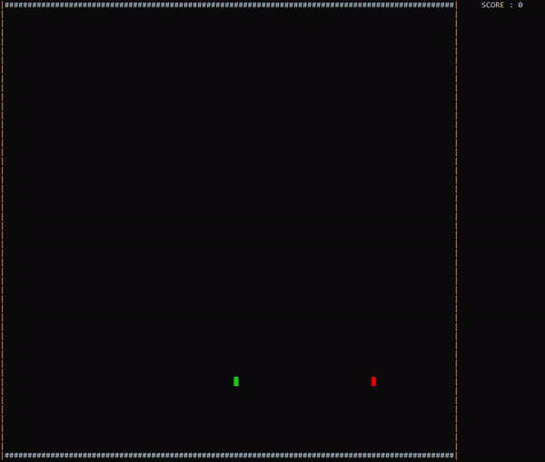

# Rainbow Snake

# Features #
1. Smooth gameplay (No flickering of screen/cursor which is common when refreshing terminal without a graphics library).
2. Colored terminal.
- [ ] Food must be generated at free spot
- [ ] End game when size of snake ==  total cells in grid
- [ ] Output score at the end in the center of grid
- [ ] Add AI snake (A* path finding algorithm)

# How to play #
Use W-A-S-D keys to move snake while avoiding walls and collecting food. (Caps lock should be OFF) 
Recommended : maximise size of terminal

