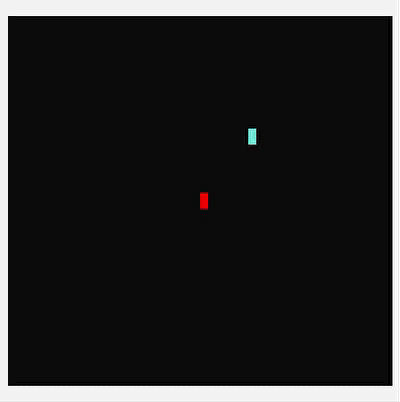
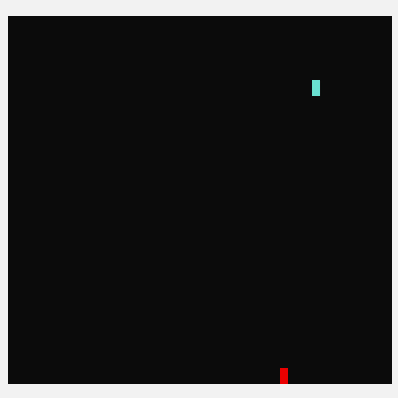
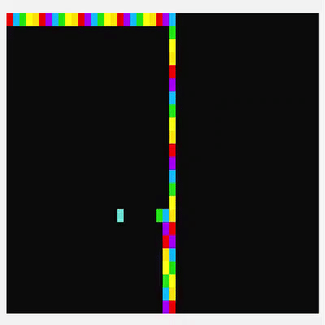

# 🐍 Snake game AI

Based on BFS algorithm

Based on Hamiltonian cycle

Based on Hamiltonian cycle and BFS

# 🌟Features #
1. Uses [double buffering technique](https://en.wikipedia.org/wiki/Multiple_buffering) to create a smooth gameplay. (No flickering of screen/cursor which is a common problem when refreshing the terminal without a graphics library).
2. Colored terminal.
3. Single player mode 
4. AI mode - Watch the snake AI play

# 🚀Setup #
> ⚠️ Game will work NOT work on online compilers and on Mac OS because of windows-specific libraries used.

- Fork project
- Compile `GameSnake.cpp` with a compiler of your choice.
## File dependencies ##
Header files  
  - Snake.h

Source files
  - Snake.cpp
  - GameSnake.cpp

The header files and source files should be in the same directory.

# 📰How to play #
In AI mode, you can only watch the AI snake move. 

In single player mode, use W-A-S-D keys to move snake while avoiding walls and collecting food. 

> ⚠️ Caps lock of keyboard should be OFF.

> ⚠️ If game is over, close current terminal before creating a new one.

# 🛑Limitations # 
- Snake appears thinner when moving vertically. This is because in the terminal there is small separation between 2 horizontal lines right on top on each other. Unfortunately, nothing can be done to get rid of this line height. 
- For the same reason as above, there is an illusion that the snake moves faster vertically. However, this speed difference was "fixed" by making snake more slower vertically using the sleep function. 
- AI algorithm that uses BFS simply makes snake chase the food as fast as possible. Average score is 300.
- Current Hamilton algorithm takes a lot of time but always results in a win (snake fills board completely).

# 🔮 Future work #
- [x] Food must be generated at free spot
- [x] End game when size of snake ==  total cells in grid
- [x] Output score at the end in the center of grid
- [x] Implement Hamilton algorithm (use an approximation of the longest path from snake head to food)
- [x] Implement a combination of Hamilton and BFS to improve Hamilton
- [ ] Improve food generation algorithm (keep track of unoccupied grid cells)

# ⛑️ Resources used #
- Getting started : https://youtu.be/AxrQje7V65o 

- BFS algorithm : https://cs.stanford.edu/people/abisee/gs.pdf

- Different AI snake algorithms : https://medium.com/analytics-vidhya/playing-snake-with-ai-2ea68f0e914a

- https://github.com/chuyangliu/Snake/tree/7227f5e0f3185b07e9e3de1ac5c19a17b9de3e3c
